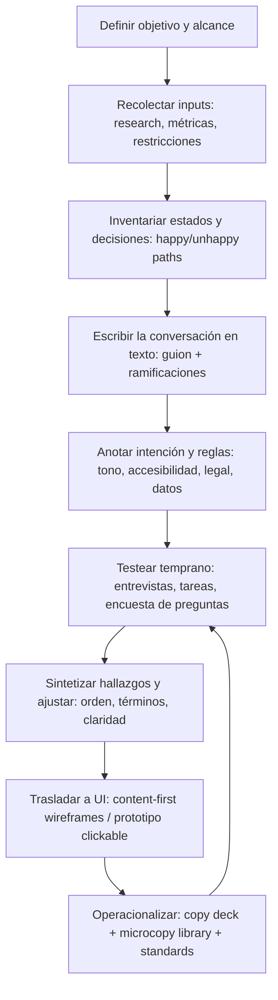

# Prototipos de contenido y artefactos de content en UX

## Resumen ejecutivo

La técnica **content prototype** (prototipo de contenido) es un artefacto de baja fidelidad centrado en **palabras, estructura y estados**: en vez de “dibujar pantallas”, prototipa **la conversación** entre un producto digital y la persona usuaria (incluyendo ramificaciones, errores, confirmaciones y tono). En su formulación más citada en UX content, puede ser un documento de texto (Word/Google Doc) “lleno de palabras” que se testea con usuarios reales para validar si el equipo está “hablando su idioma” antes de comprometer UI, componentes y código. citeturn10view0

En la práctica, los content prototypes funcionan como un “puente” entre investigación + intención (qué necesita la gente, qué quiere el negocio) y el diseño de interacción/visual (cómo se materializa). Este enfoque content‑first ayuda a evitar problemas típicos del “container‑first” (plantillas rígidas, placeholders, truncamiento, rework por longitudes reales, decisiones de layout que se vuelven restricciones arbitrarias). citeturn38view0

El ecosistema de artefactos de contenido en UX es más amplio que el content prototype. Para operar a escala se usan, entre otros: **content inventories** y **content audits** (inventariar y evaluar contenido existente), **content models** (definir tipos de contenido, campos y relaciones), guías de estilo y estándares de microcopy, **copy decks** y bibliotecas de microcopy, además de **design systems** que incorporan estándares de contenido. citeturn19view0turn21view0turn25view0turn27view0turn26view0

En evidencia empírica, aunque “content prototype” como término no siempre aparece en literatura científica de UX tradicional, sí hay trabajos académicos y gubernamentales que muestran el valor de **prototipar/iterar contenido temprano**: (a) un paper de 2013 introdujo “content prototypes” como estrategia de diseño participativo para representar el “output” (contenido) antes que la app, permitiendo diálogo contextual y elicitar requisitos cuando los usuarios no podían relacionarse con prototipos de software; citeturn33view1turn33view2 (b) cambios de microcopy en GOV.UK (p. ej., reemplazar “Start now” por “Find contact details”) generaron mejoras medibles en clics hacia la acción correcta; citeturn7view0 (c) ensayos y estudios de usabilidad en “plain language” muestran mejor comprensión y preferencias por versiones más claras, lo que conecta directamente con objetivos típicos del prototipado de contenido (comprensión, éxito de tarea, menor error). citeturn9view0turn34view1

---

## Definiciones, orígenes y fundamentos

### Qué es un content prototype

Un **content prototype** es un prototipo de baja fidelidad cuyo “material” principal es el texto: describe la interacción como **conversación** (mensajes, preguntas, respuestas, opciones, condiciones, estados). En la definición popularizada desde content‑first design, puede ser un archivo de texto (Word/Google Doc) con contenido suficiente para testear con usuarios y validar lenguaje y sentido antes de construir UI. citeturn10view0

En comunidades hispanohablantes de product content, también se lo explica como “prototipo de la historia”: un borrador esquemático del recorrido completo (inicio → nudo → desenlace) que revela puntos de fricción y touchpoints clave, con ejecución “rápida y barata”. citeturn30view0

En contextos de content design editorial, se usa como técnica de discovery: “lo mínimo” (título + breve introducción + quizá una imagen) para recolectar preguntas y necesidades reales antes de escribir la pieza final. citeturn23view0

### De dónde viene la idea

El **origen conceptual** se entiende mejor como convergencia de tres líneas:

1) **Content‑first / conversation design**: la idea de empezar por las palabras para que IA y UI emerjan de necesidades y narrativa (no de cajas vacías). citeturn10view0turn30view0  
2) **Content strategy**: disciplina formalizada por entity["people","Kristina Halvorson","content strategy author"] (definición original en su libro de 2009, citada luego por NN/g) que propone planificar creación, delivery y gobernanza de contenido útil y usable. citeturn36view0  
3) **Crítica al “placeholder UX”**: investigación y práctica muestran que no se puede testear adecuadamente jerarquía, escalabilidad, “banner blindness”, ni fallas de layout hasta incorporar contenido real; por eso se recomienda diseñar layout y contenido “uno hacia el otro”. citeturn38view0

### Definición de “artefactos de contenido” en UX

En este informe, “artefactos de content en UX” refiere a entregables y herramientas que hacen explícitos:  
- **qué** contenido existe o se necesita,  
- **cómo** se estructura (modelos, campos, metadatos),  
- **cómo** se expresa (voz/tono, microcopy),  
- y **cómo** se valida (prototipos, tests, métricas). citeturn19view0turn21view0turn25view0turn27view0

---

## Objetivos, cuándo usarlo y cómo decidir

### Objetivos principales del content prototype

Un content prototype sirve para:

**Validar comprensión y lenguaje**: testear temprano si las palabras reflejan el modelo mental del usuario (qué entiende, qué interpreta, qué decide). citeturn10view0turn23view0

**Reducir rework**: al evitar diseñar “contenedores” antes de conocer longitudes, jerarquías y variaciones, disminuye correcciones tardías (truncamientos, UI que no escala, componentes mal usados por falta de texto real). citeturn38view0turn25view0

**Alinear equipo y stakeholders**: convierte supuestos difusos en un guion tangible que permite discutir decisiones con foco en intención, no en estética. En content‑first design se reporta que iterar contenido antes de layout puede hacer emerger estructura/IA de forma más natural. citeturn10view0

**Cubrir estados**: fuerza a diseñar lo que suele omitirse: errores, vacíos, loading, confirmaciones, elegibilidad, rutas alternativas (“happy path” vs “unhappy path”). Esto conecta con prácticas de microcopy para mensajes y etiquetas (qué decir, cómo responsabilizarse, cómo indicar corrección). citeturn27view0

### Cuándo conviene usarlo

Usar content prototype suele ser especialmente valioso cuando:

- El producto es **conversacional por naturaleza** (onboarding, set‑up, formularios, “smart answers”, flujos de decisión). citeturn10view0turn7view0  
- El dominio es **regulado / sensible** (finanzas, salud, gobierno), donde una palabra cambia conducta o confianza. GOV.UK muestra impactos medibles por microcopy. citeturn7view0  
- Hay **múltiples canales** (email/SMS/in‑app/help center) y necesitás consistencia; NN/g ubica artefactos como “asset maps” y estándares para cross‑channel. citeturn36view0turn25view0  
- Hay **contenido existente** (rediseños, migraciones). En esos casos, “content‑first” no es opcional: el contenido ya existe y condiciona. citeturn38view0turn19view0

### Cómo decidir entre content prototype y otros artefactos

Una heurística práctica:

- Si la pregunta es **“¿qué le decimos al usuario y en qué orden, con qué opciones y estados?”** → content prototype / content frames / priority guide. citeturn10view0turn36view0turn37view0  
- Si la pregunta es **“¿qué contenido existe y qué calidad tiene?”** → content inventory + content audit. citeturn19view0turn31view0  
- Si la pregunta es **“¿cómo debe estructurarse el contenido para CMS/APIs y reutilización?”** → content model (estructurado) + taxonomía/metadatos. citeturn21view0turn22view0  
- Si la pregunta es **“¿cómo mantenemos consistencia a escala?”** → content standards, style guide, microcopy library, design system con contenido. citeturn25view0turn26view0turn27view0

---

## Artefactos de content en UX: tipos, formatos y usos

image_group{"layout":"carousel","aspect_ratio":"16:9","query":["content prototype document example UX writing","content model diagram boxes and arrows","content inventory spreadsheet template UX","design system content guidelines example"],"num_per_query":1}

### Plantillas y artefactos centrados en “qué contenido va”

**Content‑first wireframes / content wireframes**: wireframes que priorizan bloques de contenido y jerarquía antes que detalle visual. Un enfoque común es modelar primero con “sticky notes” (conceptos y propósito) y luego pasar a una versión más parecida a wireframe, evitando wordsmithing temprano. citeturn28view0turn38view0

**Priority guides**: alternativa “content‑first” a wireframes; el formato no es fijo (digital o papel), pero su regla es usar contenido real y enfocarse en prioridades para el usuario, sin “layout‑polishing” temprano. citeturn37view0

**Mapas de contenido / asset maps**: mapean piezas de contenido a etapas del journey, canales y objetivos. En NN/g aparece como herramienta para entender consistencia del contenido entre canales (“asset map”). citeturn36view0  
- Nota: la estructura exacta de un “mapa de contenido” varía por organización; en este informe, el formato específico **no especificado**.

### Artefactos centrados en inventariar y evaluar contenido existente

**Content inventory**: lista de “cada pieza de contenido digital” con atributos (título/nombre, URL, autor/owner, formato, fechas, metadatos, etc.). citeturn19view0turn31view0

**Content audit**: evaluación cualitativa/cuantitativa del contenido inventariado para decidir actualizar, mantener o remover, y detectar gaps. citeturn19view0turn31view0

### Artefactos centrados en estructura (modelado) para CMS y reutilización

**Content models**: documentan tipos de contenido, elementos/campos y relaciones; pueden representarse como diagrama (alto nivel) o planilla (detalle), y el nivel de detalle depende del propósito (alineación con stakeholders vs configuración de CMS y entrenamiento de autores). citeturn21view0

**Content‑first prototyping orientado a “structured content”**: introduce contenido real y estructurado en prototipos desde el día uno, apoyándose en planillas → generación de páginas/JSON, para aprender cómo las personas construyen significado desde contenido estructurado. citeturn22view0

### Artefactos de guías, estándares y operaciones de contenido

**Content style guides / content standards**: guías de tono, voz, gramática, patrones de mensajes, procesos editoriales y criterios de accesibilidad; en diseño a escala, se recomiendan integradas (o vinculadas) a design systems. citeturn25view0turn26view0

Ejemplos “oficiales” y ampliamente usados:
- entity["organization","Material Design","google design system"]: guías de writing y content design para UI. citeturn2search3turn2search7turn2search19  
- entity["organization","Carbon Design System","ibm design system"]: guidelines de contenido para interfaces de IBM. citeturn5search0  
- entity["organization","Fluent 2 Design System","microsoft design system"]: content design con recomendaciones de estilo. citeturn5search1  
- entity["organization","Polaris","shopify design system"]: sección de “Content” y reglas de gramática/errores para apps. citeturn5search2turn5search5  
- entity["organization","Mailchimp Content Style Guide","mailchimp writing guidelines"]: principios y voz/tono aplicados a contenido. citeturn5search9turn5search3turn5search16  
- entity["organization","Atlassian Design System","atlassian design system"]: sección de “content” y guías de voz/tono. citeturn4search7turn4search3  

**Microcopy libraries**: repositorios de microcopy por componente/estado/intent (botones, validaciones, errores, vacíos). Microcopy se define como texto breve y contextual que guía e informa en productos (labels, mensajes, help text). citeturn27view0  
- Nota: el “formato estándar” (Notion/Figma/Docs) depende de cada equipo; **no especificado**.

**Copy decks**: documento de entrega/hand‑off que centraliza copy con contexto y notas de implementación; su estructura varía, pero la intención es reducir ambigüedad para diseño, dev y stakeholders. citeturn12view0turn16search9  
- Nota: el template descargable referido en la fuente puede no ser accesible desde este entorno; detalle de celdas/estilos del template original: **no especificado**. citeturn12view0

**Pattern libraries y design systems con contenido**: un design system es un conjunto “living” de estándares para escalar diseño con componentes y patrones reutilizables; suele contener style guides (incluido content). citeturn26view0turn25view0  
- Una pattern library suele organizar patrones reusables (combinaciones de componentes) y puede vivir dentro de un design system. citeturn26view0

---

## Proceso para crear un content prototype

Esta sección integra prácticas desde content‑first design (prototipos en texto), content discovery y lineamientos de escribir para productos.

### Flujo recomendado

### Pasos detallados

**Definir objetivo, alcance y “unidad de conversación”**  
- ¿Qué historia se prototipa (flujo completo o tramo)? ¿Cuál es el trigger? ¿Cuál es el objetivo del usuario? (si falta, documentar como **no especificado**). El enfoque “prototipo de la historia” recomienda empezar por objetivo y punto de partida. citeturn30view0  

**Recolectar inputs mínimos (sin esperar “todo el research”)**  
- Desk research + datos existentes + hipótesis. En content discovery, incluso con presupuesto limitado, se propone prototipar temprano para aprender “lo más barato y rápido”. citeturn23view0  
- Si hay contenido existente, sumar inventario/auditoría para identificar qué mantener/actualizar/remover. citeturn19view0turn31view0

**Listar estados y reglas** (antes de escribir “bonito”)  
- Estados: vacío, error, warning, success, loading, ineligible, expiración de sesión, etc. Microcopy guidance gubernamental recomienda que mensajes expliquen qué pasó y qué hacer, evitar redundancia y asumir responsabilidad cuando algo falla. citeturn27view0

**Escribir la conversación en texto (timeboxed, sin auto‑edición temprana)**  
- En content‑first design se sugiere escribir “la conversación que tendrías en la vida real sin interfaz”, y postergar edición al inicio para que emerja estructura. citeturn10view0  
- Para interacción con ramificaciones, usar if/then (estilo “Choose Your Own Adventure”). citeturn10view0

**Anotar intención y requisitos (lo que el texto solo no captura)**  
- Notas por bloque: objetivo del microcopy, riesgo, supuestos, longitud/constraints (p. ej., “máx. 32 caracteres” si aplica; si no, **no especificado**), consideraciones de accesibilidad/inclusión, y reglas de datos (p. ej., validación). citeturn25view0turn27view0turn38view0

**Testear “lo mínimo viable” del contenido**  
Tres patrones, no excluyentes:
- **Usability test clásico**: tareas orientadas a decisiones y comprensión (no a “opiniones sobre tono”). citeturn27view0turn7view0  
- **Test de preguntas esperadas** (discovery): mostrar título + intro y pedir “1–3 preguntas que esperás que esta página responda”, para priorizar necesidades antes de escribir. citeturn23view0  
- **A/B test de microcopy** cuando hay tráfico suficiente (p. ej., CTA). GOV.UK reporta mejoras sustanciales por cambios de texto en botones. citeturn7view0  

**Iterar y conectar con UI + sistema de contenido**  
- Convertir el guion en content‑first wireframes / prototipo clickable, manteniendo contenido real (evitar volver a lorem ipsum). citeturn38view0turn25view0  
- Operacionalizar: copy deck para hand‑off, microcopy library para reutilización, y/o estándares en design system para consistencia. citeturn25view0turn26view0turn12view0turn27view0

### Herramientas recomendadas (online y offline)

**Documentos y colaboración (rápido, barato, versionable)**  
- entity["company","Google Docs","document editor"] / entity["company","Microsoft Word","word processor"]: coherentes con la definición clásica de content prototype como “documento lleno de palabras”. citeturn10view0turn23view0  
- entity["company","Google Sheets","spreadsheet app"] / entity["company","Microsoft Excel","spreadsheet software"]: útiles para inventarios, audits y prototipado de contenido estructurado (planillas como fuente). citeturn19view0turn22view0  

**Diseño/prototipado (cuando necesitás contexto visual sin subir fidelidad demás)**  
- entity["company","Balsamiq","wireframing tool"]: ejemplo de workflow “content model v1/v2” con bloques. citeturn28view0  
- entity["company","Figma","design tool"]: estándar de industria para prototipos clickable y bibliotecas internas (no define content prototypes por sí mismo, pero es común para integrarlos). citeturn25view0turn26view0  
- entity["company","Miro","collaboration whiteboard"]: útil para modelado con sticky notes y mapas (formato exacto: **no especificado**, depende del equipo).

**Prototipado “real content / structured content” en navegador (más técnico)**  
- entity["company","Jekyll","static site generator"] + entity["organization","ZURB Foundation","frontend framework"] + entity["company","Browsersync","dev live reload tool"]: stack propuesto para content‑first prototyping con contenido dinámico desde planillas, útil cuando querés simular sistemas de contenido y categorías. citeturn22view0  

**Offline**  
- Papel + post‑its (recomendado en priority guides y modelado inicial para evitar “pixel‑fixing”). citeturn37view0turn28view0

---

## Ejemplos y plantillas con estructura y fragmentos de contenido

Los siguientes 3 ejemplos están diseñados para ser **copiables** como punto de partida. Como no se especificó producto/industria/tono de marca, esos campos se marcan como **no especificado**.

### Ejemplo detallado de content prototype para onboarding

**Contexto**: flujo de creación de cuenta con verificación. Producto: **no especificado**. Región/idioma final: es‑US. Restricciones legales: **no especificado**.

**Estructura sugerida (plantilla)**

| Campo | Descripción | Ejemplo |
|---|---|---|
| Trigger | Qué inicia la historia | “El usuario toca ‘Crear cuenta’” |
| Intención del usuario | Qué busca lograr | “Acceder y empezar a usar” |
| Estados | happy/unhappy/edge | vacío, error de correo, OTP expirado |
| Conversación | guion por turnos | sistema ↔ usuario |
| Reglas | validaciones, rates, límites | “OTP válido 10 min” (**no especificado**) |
| Notas | tono, accesibilidad, localización | “Evitar culpar al usuario” citeturn27view0 |

**Fragmento del guion (texto prototipado)**  
> **Pantalla/Estado: Crear cuenta (default)**  
> **Título:** Creá tu cuenta  
> **Texto de apoyo:** Te va a tomar menos de 2 minutos.  
> **Campo:** Email  
> **Help text:** Usalo para iniciar sesión y para enviarte avisos importantes.  
> **CTA principal:** Continuar  
> **CTA secundario:** Ya tengo cuenta  
> **Nota:** “less than 2 minutes” puede requerir validación legal/claims (**no especificado**).

> **Estado: Error de email (validación)**  
> **Mensaje de error (inline):** Revisá el email e intentá de nuevo.  
> **Detalle (opcional):** Parece que falta el “@”.  
> **Regla:** si formato inválido, mostrar error inline al salir del campo.  
> **Rationale:** error debe decir qué pasa y cómo arreglarlo. citeturn27view0

> **Estado: Email ya registrado**  
> **Título:** Ese email ya tiene una cuenta  
> **Opciones:**  
> 1) **Iniciar sesión** (CTA)  
> 2) **Recuperar contraseña** (link)  
> **Nota:** esta bifurcación evita callejón sin salida y reduce frustración (métrica objetivo: abandono / completion). citeturn35view0turn38view0

> **Pantalla/Estado: Verificar email (OTP)**  
> **Título:** Ingresá el código  
> **Texto:** Te enviamos un código de 6 dígitos a **[email]**.  
> **Campo:** Código  
> **CTA principal:** Verificar  
> **Link:** Reenviar código  
> **Link:** Cambiar email  
> **Estado: OTP expirado**  
> **Mensaje:** El código venció. Pedí uno nuevo.  
> **CTA:** Reenviar código  
> **Nota de tono:** asumir responsabilidad y ser directo. citeturn27view0

**Qué valida este content prototype**  
- Terminología (“crear cuenta” vs “registrarte”), expectativas (“menos de 2 minutos”), claridad de errores, rutas alternativas, y carga cognitiva. Esto se alinea con la recomendación de testear lenguaje con contenido antes de cerrar UI. citeturn10view0turn38view0

---

### Ejemplo detallado de content‑first wireframe + content model para una página de detalle

**Contexto**: página tipo “detalle” (clase/evento/producto) con navegabilidad, SEO y reutilización multi‑canal. Dominio exacto: **no especificado**.

#### A) Content model mínimo (estructurado)

Definición base: un content model documenta tipos, elementos/campos y relaciones. citeturn21view0

| Content type | Campo | Tipo de dato | Reglas | Ejemplo |
|---|---|---|---|---|
| Item | title | string | máx. **no especificado** | “Clases de cerámica inicial” |
| Item | short_description | string | 140–200 chars (**no especificado**) | “Aprendé técnicas básicas…” |
| Item | long_description | rich text | headings + bullets | “Qué vas a hacer / Qué incluye…” |
| Item | price | number + currency | formato regional | “USD 45” |
| Item | schedule | object/list | timezone | “Sábados 10:00” |
| Item | location | object | relación | “Sede Palermo” |
| Item | prerequisites | list | opcional | “Ninguno” |
| Item | faq | list | Q/A | “¿Qué llevo?” → “Te damos materiales…” |
| Item | cta_primary_label | string | verbo + resultado | “Reservar lugar” |
| Item | related_items | relation | 0..n | “Cerámica intermedia” |

**Por qué esto importa**: content‑first prototyping para sistemas dinámicos propone trabajar con planillas/estructuras para que cambios se propaguen y se pueda testear significado/estructura temprano. citeturn22view0

#### B) Content‑first wireframe (en bloques)

Basado en la práctica de modelar primero con bloques (“sticky notes”) para definir prioridades y orden, antes de escribir copy final o diseñar UI. citeturn28view0turn37view0

1) **H1 (title)**  
2) **Propuesta de valor (short_description)**  
3) **CTA principal** + “qué pasa después”  
4) **Detalles clave (schedule, location, price)**  
5) **Descripción larga con subtítulos**  
6) **FAQ**  
7) **Contenido relacionado**  

**Fragmento de copy (borrador, intencionalmente no perfecto)**  
- H1: “Clases de cerámica inicial”  
- Subheadline: “Arrancá desde cero y llevate tu primera pieza.”  
- CTA: “Reservar lugar”  
- Microcopy debajo del CTA: “Podés cancelar hasta 24 h antes.” (política: **no especificado**)

**Qué se valida**  
- Jerarquía y orden (¿qué debería estar arriba?), claridad del CTA, y si el layout futuro puede acomodar longitudes reales (evitar truncamiento y rework). citeturn38view0turn28view0

---

### Ejemplo detallado de microcopy library + mini copy deck para un design system interno

**Contexto**: equipo que quiere consistencia en mensajes y labels en un producto. Marca/voz: **no especificado**.

#### A) Microcopy library (estructura)

Microcopy: texto breve y contextual que guía/informa (mensajes, labels, help). citeturn27view0

| Componente | Estado/Intent | Texto | Uso | Notas de accesibilidad/localización |
|---|---|---|---|---|
| Button | Primary action | “Guardar cambios” | cuando persiste | evitar “OK” genérico citeturn27view0 |
| Form field | Help text | “Usá DD/MM/AAAA” | formato requerido | no repetir lo obvio citeturn27view0 |
| Alert | Error | “No pudimos guardar tus cambios.” | falla de sistema | asumir responsabilidad citeturn27view0 |
| Alert | Error + fix | “Revisá los campos marcados.” | validación | decir cómo corregir citeturn27view0 |
| Empty state | No data | “Todavía no tenés reportes.” | primera vez | sugerir próximo paso |
| Dialog | Destructive confirm | “¿Eliminar este archivo?” | irreversible | CTA claro (Eliminar/Cancelar) |

#### B) Copy deck (mini) para hand‑off

NN/g señala que los estándares de contenido ayudan a que UI y contenido se diseñen en paralelo, y que integrar content standards en design systems mejora consistencia y eficiencia. citeturn25view0turn26view0

**Pantalla: Perfil → Editar email**  
- Elemento: Título  
  - Copy: “Actualizar email”  
  - Nota: sentence case recomendada en varios sistemas (p. ej., Microsoft). citeturn5search1turn5search22  
- Elemento: Campo “Email” (label)  
  - Copy: “Email”  
  - Help: “Te lo vamos a pedir para iniciar sesión.”  
- Elemento: Botón principal  
  - Copy: “Guardar cambios”  
- Estados  
  - Success banner: “Listo: actualizamos tu email.”  
  - Error banner: “No pudimos actualizar tu email. Probá de nuevo.”  
  - Nota: evitar culpar; ser directo; dar acción siguiente. citeturn27view0

---

## Evidencia, estudios de caso y métricas

### Evidencia directa relacionada con “content prototyping”

Un aporte académico explícito aparece en un paper de 2013 sobre diseño participativo en contextos de baja alfabetización digital. Los autores introducen “content prototype” como representación del **contenido producido** por un sistema, posponiendo el diseño de la aplicación: usan muestras de contenido para iniciar conversación, mostrar escenarios de uso y elicitar requisitos cuando prototipos de software (aun low‑fi) no eran comprendidos o no resultaban relevantes para los participantes. citeturn33view0turn33view1

El mismo trabajo reporta que el contenido de muestra ayudó a “ground” las interacciones, facilitó discusión sobre uso y necesidades, y permitió revelar diferencias entre capas de usuarios (creadores vs consumidores/distribuidores) gracias al content prototype. citeturn33view2  
- Métricas cuantitativas específicas del impacto (p. ej., tasa de éxito, tiempo) en ese estudio: **no especificado** en las secciones capturadas. citeturn33view2

### Evidencia empírica sobre impacto del contenido en métricas UX

**Caso GOV.UK (microcopy medible en comportamiento)**  
GOV.UK reportó tests A/B donde cambios de contenido mejoraron métricas de journeys. En un ejemplo, cambiar el texto de un botón de “Start now” a “Find contact details” generó aumentos de clics en el botón (30% en mobile, 14% en desktop), y estimaron cientos de miles de sesiones exitosas adicionales por año al guiar mejor al usuario hacia la acción correcta. citeturn7view0  
Este caso es relevante porque muestra que **variantes de microcopy** (una pieza pequeña de contenido) pueden cambiar decisiones y éxito de tarea en gran escala. citeturn7view0

**Plain language (comprensión y preferencia)**  
Un ensayo controlado aleatorizado (online, internacional) comparó recomendaciones en lenguaje llano vs estándar y reportó mayor comprensión en el grupo plain language (diferencia estadísticamente significativa) y preferencia general por la versión clara. citeturn9view0  
Además, un reporte de pruebas de usabilidad de versiones “plain language” de un texto legal encontró que participantes trabajando con versiones en lenguaje llano tendían a completar más preguntas y a identificar más respuestas correctas que quienes usaban la versión actual, junto con menor dificultad percibida. citeturn34view1

### Métricas a instrumentar cuando trabajás con content prototypes

Un content prototype se puede medir con métricas de UX y contenido, por ejemplo:

- **Completion rate**: porcentaje de transacciones completadas sobre iniciadas (definición operativa clara en GOV.UK Service Manual). citeturn35view0  
- **Éxito de tarea y errores**: NN/g sugiere que estándares de contenido pueden impactar métricas user‑focused como satisfacción, engagement, error rates y conversion. citeturn25view0  
- **Comprensión**: tests de comprehension (como en el RCT de plain language). citeturn9view0  
- **Señales cualitativas**: confusiones recurrentes, vocabulario real del usuario, preguntas “esperadas” (técnica de discovery). citeturn23view0

---

## Comparativa, buenas prácticas, riesgos y recursos

### Tabla comparativa: content prototype vs otros artefactos

| Artefacto | Qué responde | Ventajas | Limitaciones | Cuándo elegir |
|---|---|---|---|---|
| Content prototype | “¿Qué conversación estamos diseñando?” | Muy barato; revela estados; testea lenguaje temprano citeturn10view0turn30view0 | Puede no mostrar fricción visual/interaction detallada; riesgo de que lo tomen como “copy final” (mitigar) | Discovery, MVP, flujos críticos, productos regulados |
| Content frames | “¿Qué va en cada bloque de contenido?” | Trae contenido temprano al proceso citeturn36view0 | Menos útil para ramificaciones complejas (depende de formato) | Ideación temprana antes de wireframes |
| Content‑first wireframes | “¿Qué jerarquía/orden tiene la pantalla?” | Evita placeholders; estructura antes de estética citeturn28view0turn38view0 | Puede inducir discusión de layout demasiado temprano | Cuando ya hay IA preliminar y necesitás contexto visual |
| Priority guides | “¿Qué es lo más importante aquí?” | Enfoca prioridades; útil en responsive; evita pixel‑fixing citeturn37view0 | No es deliverable final; requiere disciplina en anotaciones | Inicio de proyecto, definición de contenido por pantalla |
| Content model | “¿Qué tipos/campos y relaciones necesita el sistema?” | Habilita reutilización, CMS/APIs, consistencia estructural citeturn21view0turn22view0 | Requiere alineación técnica/IA; puede sentirse “pesado” | Plataformas con mucho contenido, omnicanal, CMS |
| Content inventory | “¿Qué contenido existe?” | Visibilidad total, ownership, metadatos citeturn19view0turn31view0 | No evalúa calidad por sí sola citeturn19view0 | Rediseños, migraciones, governance |
| Content audit | “¿Qué está bien/mal y qué hacemos?” | Identifica gaps, duplicados, remoción y mejoras citeturn19view0turn31view0 | Laborioso; necesita criterios claros | Optimización continua, replatforming, SEO/UX |
| Content style guide / standards | “¿Cómo escribimos de forma consistente?” | Escala coherencia; acelera decisiones citeturn25view0turn26view0 | Requiere mantenimiento y adopción | Equipos creciendo, múltiples squads, productos maduros |
| Microcopy library | “¿Qué patrón de texto usamos por componente/estado?” | Reutilización de mensajes; reduce inconsistencias citeturn27view0turn25view0 | Puede volverse obsoleta si no hay governance | Productos con muchos formularios/estados |
| Copy deck | “¿Cuál es el copy final + notas de implementación?” | Hand‑off claro; trazabilidad para reviews citeturn12view0turn16search9 | Menos útil para discovery; puede duplicar info si no está integrado | Etapas cercanas a build/release |
| Pattern library / Design system con contenido | “¿Cómo componemos UI + contenido a escala?” | Single source of truth; UI+content alineados citeturn26view0turn25view0 | Alto costo inicial; requiere equipo de mantenimiento citeturn26view0 | Organizaciones con múltiples productos/equipos |

### Buenas prácticas y checklist (operativo)

**Checklist de calidad para un content prototype**
- Cobertura de estados: vacío, error, éxito, loading, elegibilidad, expiración. citeturn27view0turn30view0  
- Lenguaje: términos del usuario (validar con tests), evitar jerga interna, headings claros. citeturn23view0turn34view1  
- CTAs: verbos que describan resultado (evitar “Start now” genérico si confunde). citeturn7view0turn27view0  
- Responsabilidad: cuando algo falla, el sistema asume responsabilidad y ofrece salida. citeturn27view0  
- Longitudes: anotar constraints (si no existen, documentar como **no especificado**) y evitar que UI herede suposiciones falsas. citeturn38view0  
- Trazabilidad: versión, fecha, owner, decisiones abiertas (**no especificado** si no se define).  
- Preparación para escala: si hay múltiples canales, mapear consistencia cross‑channel (asset map) o anotar “dónde vive” el contenido. citeturn36view0turn25view0

### Riesgos comunes y mitigaciones

**Riesgo: stakeholders lo interpretan como copy final**  
Mitigación: rotular claramente “borrador para test”, separar “intención” vs “redacción final”, y mantener versionado (doc + changelog). La disciplina de “no editar al inicio” existe para explorar, no para cerrar. citeturn10view0

**Riesgo: se testea “opinión de tono” en vez de comprensión**  
Mitigación: diseñar tareas orientadas a objetivos; usar técnica de preguntas esperadas o tests de comprensión. citeturn23view0turn9view0

**Riesgo: faltan edge cases (después aparecen bugs de contenido)**  
Mitigación: checklist de estados + uso de guías de microcopy y estándares de contenido; integrar con design system. citeturn27view0turn25view0

**Riesgo: inconsistencias entre squads**  
Mitigación: content standards en design system + microcopy library + auditorías periódicas. citeturn25view0turn19view0turn26view0

### Lecturas y recursos prioritarios

**Fundamentos / definiciones**
- Content prototypes en content‑first design (definición y forma “Word/Google Doc”). citeturn10view0  
- Content strategy y definición original atribuida a Kristina Halvorson. citeturn36view0  
- Layout vs content (por qué el contenido real importa temprano). citeturn38view0  
- Content inventory + audit (definiciones, atributos y criterios). citeturn19view0turn31view0  
- Content modeling (definición formal y representación). citeturn21view0  

**Práctica content‑first y prototipado**
- Content discovery con content prototype “barato” y test de preguntas. citeturn23view0  
- Content‑first prototyping con structured content (framework y herramientas). citeturn22view0  
- Priority guides como alternativa content‑first a wireframes. citeturn37view0  
- Content modeling con wireframes/stickies (v1/v2) para alinear. citeturn28view0  

**Evidencia y medición**
- Caso GOV.UK con mejoras cuantitativas por cambios de microcopy y A/B testing. citeturn7view0  
- Definición operativa de completion rate (para instrumentación). citeturn35view0  
- RCT de plain language con mejora de comprensión. citeturn9view0  
- Reporte de usabilidad sobre plain language (más preguntas completadas + más respuestas correctas). citeturn34view1  
- Paper académico que introduce “content prototype” como artefacto de output para participación y elicitar requisitos. citeturn33view1turn33view2  

**Recursos en español (cuando existen)**
- Artículo de entity["organization","Torresburriel Estudio","ux consultancy spain"] sobre inventario y auditoría de contenido (definiciones y atributos). citeturn31view0  
- Artículo de entity["company","Mercado Libre","ecommerce platform"] (MELI UX) sobre “contenido primero”, content briefing y “prototipo de la historia” en 4 pasos. citeturn30view0