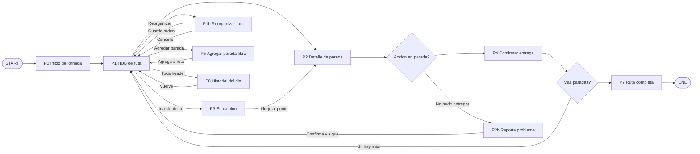

# User Flow — Ruta Flex: Copiloto de entregas

**Versión:** 1.0
**Fecha:** Abril 2026
**Producto:** App Envíos Flex — Rediseño de ruta activa
**Herramienta:** FigJam (editable) + documentado acá como referencia

---

## Diagrama



---

## Flujo de navegación

Extraído del documento de solución. El esquema general es:

```
P0 → P1 → [tap parada] → P2 → [Ya lo entregué] → P1 (actualizado)
P1 → [Ir a siguiente] → P3 → [Llegué] → P2
P1 → [Reorganizar] → P1b (modo drag)
P2 → [No pude entregar] → P2b (problema)
P1 → [+ Agregar] → P5 (parada libre)
P1 → [header tap] → P8 (historial del día)
P3 → [≡ header] → P1b (reorganizar sin salir)
Todas entregadas → P7 → END
```

---

## Descripción de pantallas

| ID | Nombre | Rol en el flujo |
|----|--------|----------------|
| P0 | Inicio de jornada | Punto de partida. El transportista confirma carga y empieza |
| P1 | Vista de ruta — HUB | Pantalla principal. Se vuelve acá después de cada entrega |
| P1b | Reorganizar ruta | Modo drag. Permite cambiar el orden manualmente |
| P2 | Detalle de parada | Dirección completa, receptor, paquetes, CTAs de acción |
| P2b | Reporta problema | Selección de motivo cuando no se puede entregar |
| P3 | En camino | Navegación activa. Vista de mapa + bottom sheet |
| P4 | Confirmar entrega | Registra la entrega: forma + foto + firma opcional |
| P5 | Agregar parada libre | Bottom sheet para insertar trámite o pausa en la ruta |
| P7 | Ruta completada | Cierre de jornada. Stats del día + acceso a resumen |
| P8 | Historial del día | Vista del progreso completo de la jornada actual |

---

## Decisiones clave del flujo

### ¿Por qué P1 es el HUB?
P1 es la pantalla a la que el transportista vuelve siempre: después de cada entrega, después de un problema, después de reorganizar. Es el punto de control central de la jornada.

### ¿Por qué P3 existe como pantalla separada?
El estado "en camino" entre dos paradas tiene necesidades distintas al detalle de la parada. El transportista necesita el mapa en foco, no el formulario. P3 mantiene visibilidad del contexto (próxima parada, ETA) sin requerir interacción hasta llegar.

### ¿Por qué P2b vuelve a P1 y no a P2?
Una vez que se reporta un problema, esa parada queda marcada. El flujo correcto es volver al HUB de ruta para continuar con la siguiente parada — no quedarse en el detalle de una parada ya procesada.

### Loop de paradas (DEC2 → P1)
Después de confirmar una entrega, si quedan paradas pendientes el sistema vuelve a P1. Esto mantiene la coherencia: el transportista siempre ve el estado actualizado de su ruta antes de moverse a la siguiente.

---

## Estados de error transversales

Estos estados pueden ocurrir en cualquier punto del flujo:

| Error | Origen | Recuperación |
|-------|--------|-------------|
| GPS perdido | P3 (En camino) | Aviso no bloqueante. Puede seguir operando sin mapa |
| Sin conexión | Cualquier pantalla | Banner persistente. Modo offline con último estado cacheado |
| Error al confirmar entrega | P4 (Confirmar) | Toast de error + CTA "Reintentar". Vuelve a P2 |
| Sesión expirada | Cualquier pantalla | Modal bloqueante. Redirige a login |

---

## Notas de diseño

- **Flujo feliz** (happy path): START → P0 → P1 → P2 → P4 → loop P1 → P7 → END
- **P1b y P5** son acciones opcionales que no interrumpen el flujo principal — siempre regresan a P1
- **P3** es opcional pero mejora la experiencia outdoor: el transportista puede ir directo P1 → P2 tocando la card, o usar P3 para la navegación activa
- **P8** es acceso pasivo al historial — no bloquea, no redirige

---

## Referencia en FigJam

El diagrama editable está en FigJam:
[User Flow — Ruta Flex: Copiloto de entregas](https://www.figma.com/online-whiteboard/create-diagram/eb143d99-d0d0-46c9-ba30-5760bd0db185)
